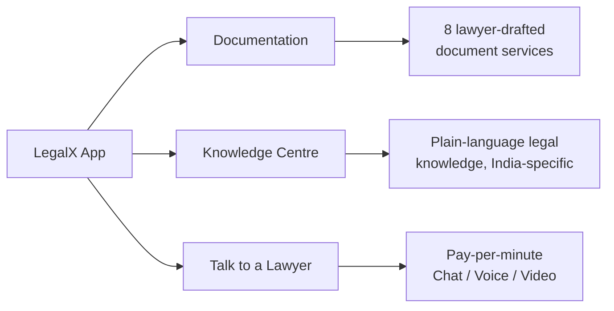

# 01. Product Vision — LegalX V1

> **Status:** Approved for build reference
> **Owns:** Product Manager, Founder
> **Read this first.** Every other document in this set (02–24) inherits scope, tone, and boundaries from this file. If a future document conflicts with this one, this one wins.

---

## 1. What LegalX Is

LegalX is a mobile-first, AI-assisted legal-tech platform for India that gives small business owners, freelancers, and individuals two things they currently have to choose between:

- **Speed and affordability** of DIY document-filing sites
- **Trust and accountability** of a traditional law firm

LegalX sits in the middle: lawyer-drafted documents at fixed, transparent prices, plus direct pay-per-minute access to verified advocates — all inside one app.

**Positioning statement:**
*"Faster and more affordable than a law firm. More trustworthy than a document mill."*

**Brand tone:** Clear, Trustworthy, Approachable, Efficient.

---

## 2. Who It's For

### Primary user (document buyer / consultation seeker)
Indian small business owners, freelancers, and individuals who need routine legal work done — GST registration, trademark filing, a rent agreement, an affidavit — without hiring a lawyer full-time, and who occasionally need to actually talk to one.

### Secondary user (supply side)
Enrolled Advocates (Bar Council registered) who monetize spare time via pay-per-minute chat, voice, and video consultations, and who fulfil document-drafting orders.

LegalX is a **two-sided marketplace**. Every document in this set should account for both sides where relevant, even though V1's UI is buyer-facing first, with a lawyer-facing PWA dashboard covered separately.

---

## 3. The Three Pillars

1. **Documentation** — Buy a lawyer-drafted legal document (e.g. GST Registration, Trademark, Rent Agreement) at a fixed price. No negotiation, no ambiguity.
2. **Knowledge Centre** — Free, bite-sized legal literacy content (India-specific), sourced from GitHub-hosted content already built by another team. LegalX does **not** redesign this in V1 — only wraps it.
3. **Talk to a Lawyer** — On-demand or scheduled Chat/Voice/Video consultation with a verified, enrolled Advocate, billed per minute.

---

## 4. V1 Scope — What We Are Building

This is intentionally a **thin, complete slice**, not a feature-rich release. Every module below must exist and work end-to-end for launch (target: September 2026).

| Module | V1 Deliverable |
|---|---|
| Home | Welcome, search, 3 service entry points, LX Coin balance display, popular documents, popular lawyers |
| Documentation | Exactly 8 services, each with video placeholder, intro, price, key details, checklist, what's included, FAQ, Buy Now → Billing |
| Document Verification | Package selection, document upload, → Billing (`order_type = verification`) — see §4a and `26_Module_Document_Verification.md` |
| Knowledge Centre | Placeholder UI only. Content fetched from GitHub later. No redesign. |
| Talk to Lawyer | Lawyer discovery, search, filters, profile cards, profile detail, Chat/Voice/Video selection |
| Consultation Booking | Mode selection → date (next 5 days only) → time → Billing |
| Billing | User details, coupon, order/consultation summary, price breakdown, Razorpay checkout |
| Profile | Profile view/edit, LX Coins, favourite lawyers, call history, transactions, support, logout |

### The 8 Document Services (fixed list — do not add/remove without a scope change)
1. GST Registration
2. Monthly GST Return Filing (GSTR-1 + GSTR-3B)
3. Trademark Registration
4. Udyam (MSME) Registration
5. DPIIT Startup India Recognition
6. Legal Notice Drafting (Recovery / Cheque Bounce / Tenant Eviction)
7. Rent / Lease Agreement Drafting
8. Affidavit Drafting

Content for all 8 is finalized — see `19_Document_Services_Content_Map.md`.

---

## 4a. Scope Addition — Document Verification (dated scope-change note)

**Added:** confirmed via founder-provided flow diagrams, post-launch-scope-lock.

A third order type, **Document Verification**, joins Documentation and Talk to Lawyer as a paid flow feeding the shared Billing screen (`02_Information_Architecture.md` §4, `11_Module_Billing_Payments.md`). Flow: Select Package → Upload Document → Continue → Billing (`order_type = verification`) → Payment → Confirmation. Full spec in `26_Module_Document_Verification.md`.

**Open decision, not yet resolved:** whether the "Verification Package" selector includes an AI-only analysis tier (no human review) alongside a human-expert tier. An AI-only tier would functionally be an AI Legal Assistant feature, which Section 5 below excludes from V1. Until explicitly confirmed, V1 build assumes **human-reviewed verification only** — see `26_Module_Document_Verification.md` §3 for the specific flag.

---

## 5. Explicitly Out of Scope for V1

These are real, validated ideas — several appear in reference/inspiration builds reviewed during design — but including any of them in V1 dilutes launch focus. They live in `24_Future_Roadmap_Parking_Lot.md` and require a deliberate scope decision to pull forward.

| Excluded | Why it matters, but not now |
|---|---|
| AI Legal Assistant / AI Chat | High infra + compliance cost; V1 proves the marketplace works without it first |
| Document Modification (post-purchase editing) | Requires versioning + drafting workflow not yet built |
| Order Tracking | V1 flow is "buy → advocate fulfils off-app / via dashboard"; no in-app tracker yet |
| Case Prediction | Needs a data moat LegalX doesn't have at launch |
| Wallet Rewards Logic (beyond simple LX Coin balance display) | LX Coin **balance display** is in V1; recharge tiers, cashback, referral rewards are not |
| Legal Vault / Encrypted Document Storage / Escrow | Seen in reference concepts; adds real security/compliance surface area — deliberate V2 decision |

**Rule for every downstream doc:** if a feature isn't in Section 4, it doesn't get built in V1, regardless of how good it looks in a reference design.

---

## 6. Success Criteria for V1

- A user can go from Home → pick a document → pay → receive confirmation, in under 5 taps of Buy Now.
- A user can go from Home → find a lawyer → book a consultation (Chat/Voice/Video) → pay, in one continuous flow.
- All 8 document pages are content-complete and template-driven (one page component, 8 data payloads — not 8 hand-built pages).
- Knowledge Centre placeholder does not block launch; it's swappable once GitHub content-fetch ships.
- Zero scope creep into Section 5 items without an explicit, dated scope-change note appended to this file.

---

## 7. How to Use This Document Set

- **New developer onboarding:** read 00 → 01 → 02 → 03, then the module doc for whatever you're building.
- **Antigravity / Claude (build agents):** treat 01–05 as constraints, 06–19 as build specs, 20–23 as guardrails, 24 as "don't build this yet."
- **Every module doc (06–12) must reference back to this file's Section 4/5 boundary** so scope drift is caught at doc-review time, not at code-review time.

---

*Next: `02_Information_Architecture.md` — full sitemap and navigation structure, pending your approval to proceed.*
