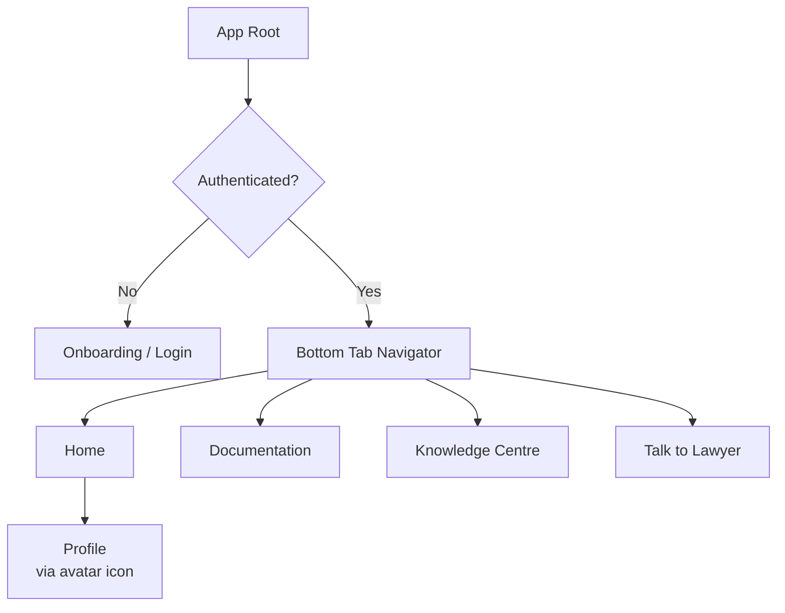
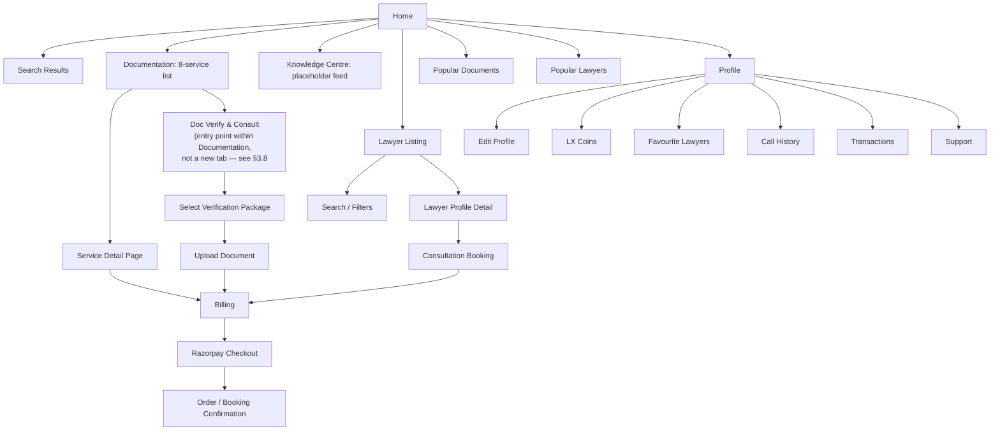
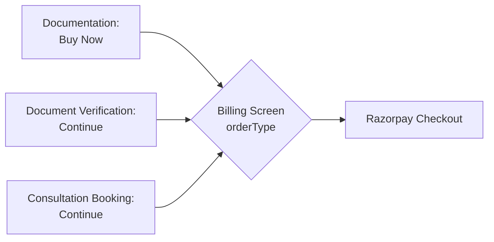

# 02. Information Architecture — LegalX V1

> **Depends on:** `01_Product_Vision.md` (scope boundary)
> **Feeds into:** `05_Screen_Inventory.md`, all module docs (06–12)

---

## 1. Navigation Model

LegalX V1 uses a **4-tab bottom navigation** plus a **profile entry point** from the top of Home (not a 5th tab). This matches the wireframes and both reviewed prototypes.

**Tab order (fixed):** Home → Documentation → Knowledge Centre → Talk to Lawyer
Profile is reached by tapping the avatar/profile icon on Home — it is a stack pushed on top of the tab navigator, not a tab itself. This matches the wireframe pattern (`By clicking of profile →`).

---

## 2. Full Sitemap

---

## 3. Screen-Level Breakdown by Module

### 3.1 Home
- Home (root)
- Search results (in-page or pushed screen — decide in `06_Module_Home.md`)

### 3.2 Documentation
- Service list (8 cards, template-driven)
- Service detail (1 template × 8 data payloads):
  - Video placeholder → Intro → Price → Key Details → Why choose → Document checklist → What's included → FAQ → Buy Now
- → pushes to **Billing**

### 3.3 Knowledge Centre
- Feed/placeholder list (category tabs, per wireframe: My feed / Cyber / Traffic / Posco style categories — final taxonomy owned by the existing Knowledge Centre team)
- Article detail placeholder (GitHub-fetched later)

### 3.4 Talk to Lawyer
- Lawyer listing (search + filters)
- Lawyer profile detail (rating, reviews, experience, languages, practice areas, about, consultation pricing)
- → pushes to **Consultation Booking**

### 3.8 Document Verification (new — see `01_Product_Vision.md` §4a)
- Entry point: a "Doc Verify & Consult" card/button within the Documentation module (Home or Service List), **not a 5th tab** — keeps the 4-tab nav rule from §1 intact
- Select Package (package tiers pending confirmation — see `26_Module_Document_Verification.md` §3)
- Upload Document (file upload, language, problem type per wireframe)
- → pushes to **Billing** with `order_type = verification`

### 3.5 Consultation Booking
- Mode selection (Chat / Voice / Video)
- Date selection (next 5 days only, per Product Vision §4)
- Time selection
- → pushes to **Billing**

### 3.6 Billing
- Shared by both Documentation purchases and Consultation bookings
- User details → coupon → summary (service or consultation) → price breakdown → Buy Now → Razorpay

### 3.7 Profile
- Profile (view)
- Edit Profile
- LX Coins (balance view — no recharge/reward logic in V1, per Product Vision §5)
- Favourite Lawyers
- Call History
- Transactions
- Support
- Logout

---

## 4. Cross-Module Rule: Billing Is a Single Shared Screen

**Confirmed via founder-provided "Final Payment Architecture" diagram: three flows, one shared Billing screen.** One Billing screen accepts a polymorphic order payload with `order_type` = `document` | `verification` | `consultation`:

This is a deliberate architectural decision — see `13_Data_Model_Supabase_Schema.md` §2.6 for the shared `orders` entity representing all three order types, and `11_Module_Billing_Payments.md` §2.2 for the payload shapes.

---

## 5. Deep-Link Considerations (flag for `18_API_Integration_Contracts.md`)

- Service detail pages should be deep-linkable (`legalx://document/gst-registration`) for marketing/WhatsApp sharing.
- Lawyer profiles should be deep-linkable for referral/share flows (seen as a pattern worth keeping in reference builds — "Share Profile" — even though full referral rewards are V2).

---

## 6. What This Doc Deliberately Excludes

Per `01_Product_Vision.md` §5: no Vault/Escrow tab, no Drafts marketplace tab, no AI Chat tab, no Order Tracking screen. The tab bar is 4 tabs, not 5+, by design — do not add a 5th tab in later docs without a scope-change note in `01`.

---

*Next: `03_User_Personas_and_Journeys.md` — buyer and lawyer personas with end-to-end journey maps, pending your approval to proceed.*
