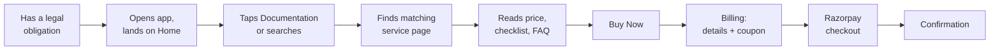
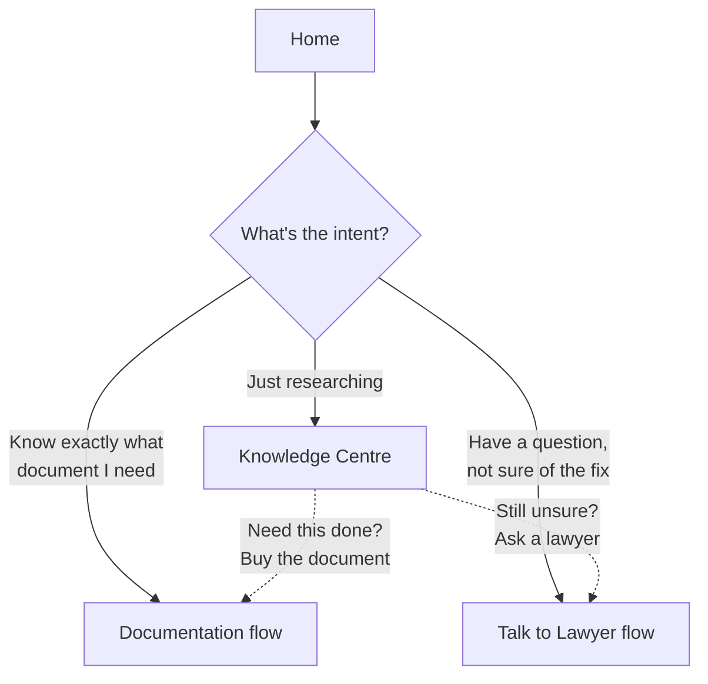
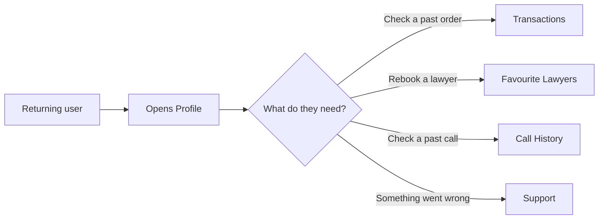

# 03. User Personas & Journeys — LegalX V1

> **Depends on:** `01_Product_Vision.md`, `02_Information_Architecture.md`
> **Feeds into:** all module docs (06–12), `21_Analytics_Events.md`, `22_QA_Test_Plan.md`

---

## 1. Personas

LegalX is two-sided. V1 UI is buyer-facing; the lawyer side is a separate PWA dashboard (out of scope for this app doc set, referenced only where the app must integrate with it — e.g. availability, consultation join links).

### 1.1 Primary — "Compliance Buyer"
**Who:** Small business owner, freelancer, or early-stage founder in India. Non-lawyer. Time-poor, price-sensitive, wants certainty over cost.
**Trigger:** A specific, dated legal obligation — GST threshold crossed, needs a rent agreement for a new office, received a cheque-bounce situation, needs Udyam for a loan application.
**Wants:** Fixed price, no back-and-forth, a human they can escalate to if the form-fill isn't enough.
**Fears:** Getting a document rejected by a government portal because it was drafted wrong; being upsold; not knowing if the "lawyer" is real.
**Success looks like:** Document delivered correctly, on the stated timeline, without needing to leave the app.

### 1.2 Secondary — "Consultation Seeker"
**Who:** Often the same buyer, but arriving with a question a static document can't answer ("Can I actually evict this tenant?", "Is this cheque bounce notice enough?").
**Trigger:** Ambiguity or dispute — something a checklist can't resolve.
**Wants:** To reach a real, verified advocate quickly, know the cost upfront (per-minute, no surprise bill), and pick their communication mode (some prefer voice/video over typing).
**Fears:** Being billed for a bad-quality call; talking to someone who isn't actually enrolled to practice.
**Success looks like:** Got a straight answer from someone credentialed, for a price they saw before starting.

### 1.3 Supply side — "Verified Advocate" (context only — full spec lives outside this app's doc set)
**Who:** Enrolled Advocate (Bar Council registered) monetizing spare time.
**Wants:** Predictable payout, no unpaid consultation time, protection from solicitation-rule exposure (see Product Vision — Rule 36 flag).
**Relevance to this doc set:** The app must surface advocate profile data (rating, experience, languages, practice areas, pricing) accurately and respect advocate-set availability windows — covered in `09_Module_Talk_to_Lawyer.md`.

---

## 2. Journey Map — Document Purchase (Primary flow)

**Where this can break (flag for QA):**
- Step D → E: if the 8 services aren't clearly distinguishable from Home search, buyer bounces. Search must resolve to the right service, not a generic list.
- Step E: checklist must be scannable in under 10 seconds — buyers won't read dense legalese before paying.
- Step G: coupon field must not block progress if empty — this is a common abandonment point in Indian checkout flows.

---

## 3. Journey Map — Consultation Booking (Secondary flow)

```mermaid
flowchart LR
    A[Has a question<br/>a document can't answer] --> B[Opens app]
    B --> C[Taps Talk to Lawyer]
    C --> D[Searches / filters<br/>by practice area]
    D --> E[Views profile:<br/>rating, exp, languages]
    E --> F[Picks Chat,<br/>Voice, or Video]
    F --> G[Picks date<br/>next 5 days only]
    G --> H[Picks time slot]
    H --> I[Billing]
    I --> J[Razorpay<br/>checkout]
    J --> K[Confirmation +<br/>join link/reminder]
```

**Where this can break:**
- Step D: filters must include practice area and language — both content doc and wireframes confirm these are decision-critical, not nice-to-have.
- Step F: price-per-minute must be visible at the mode-selection step, not hidden until Billing — buyers in the reference builds saw per-mode pricing inline (₹/min next to each mode button), and that pattern should carry over since it reduces bill-shock.
- Step G/H: 5-day window is a hard V1 constraint (Product Vision §4) — do not let a developer "improve" this into an open calendar without a scope note.

---

## 4. Journey Map — Cross-Sell (Home → either flow)

Knowledge Centre is a placeholder in V1, but its role in the journey is still real: it's the top-of-funnel entry for buyers who don't yet know which of the other two flows they need. Both CTAs from Knowledge Centre content (seen in wireframes: "Talk to lawyer" button on article pages) should route into the flows above, not create a third path.

---

## 5. Journey Map — Profile / Repeat Use

No order-tracking UI in V1 (Product Vision §5) — Transactions shows purchase history/receipts, not live fulfilment status. Set this expectation now so `12_Module_Profile.md` doesn't quietly reintroduce tracking UI under a different name.

---

## 6. Persona-to-Module Cross-Reference

| Persona | Primary modules touched | Doc reference |
|---|---|---|
| Compliance Buyer | Home, Documentation, Billing, Profile | 06, 07, 11, 12 |
| Consultation Seeker | Home, Talk to Lawyer, Consultation Booking, Billing | 06, 09, 10, 11 |
| Verified Advocate (external) | Talk to Lawyer (data source only) | 09 (read-only integration notes) |

---

*Next: `04_Design_System.md` — colors, type, spacing, and component states, pending your approval to proceed.*
