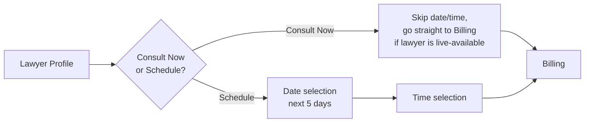

# 09. Module Spec — Talk to Lawyer (SCR-07, SCR-08, SCR-09)

> **Depends on:** `01_Product_Vision.md` (enrolled Advocates only), `04_Design_System.md` (§5.2 Lawyer Profile Card, §5.8 Mode Selector), `05_Screen_Inventory.md`
> **Feeds into:** `10_Module_Consultation_Booking.md`, `13_Data_Model_Supabase_Schema.md`, `14_Auth_and_Roles.md`, `15_Realtime_Communication_Agora.md`

---

## 1. Purpose & Compliance Boundary

This module surfaces **only enrolled Advocates** (Bar Council registered) — not non-enrolled LL.B. graduates — per the legal opinion referenced in Product Vision (citing *Bar Council of India v. A.K. Balaji*, 2018). This is a hard data-layer constraint, not a UI filter option: the app must never be capable of listing a non-enrolled individual as bookable, even accidentally through a bad admin entry.

**Rule 36 flag (carried forward from legal review):** profile copy, marketing language, and any "recommended for you" framing must avoid anything read as solicitation on the advocate's behalf. This affects copywriting in `19_Document_Services_Content_Map.md`-adjacent content work, not this doc's structure, but is flagged here so engineering doesn't build a "sponsored lawyer" ad unit later without revisiting this constraint.

---

## 2. Screen: SCR-07 Lawyer Listing

### 2.1 Layout

- Search bar (name or keyword) → SCR-08 filter/refine
- LX Coin balance chip (top-right, consistent with Home header per `04`)
- Grid of Lawyer Profile Cards (`04_Design_System.md` §5.2): photo, rating, review count, name, specialization, experience, language tags, per-mode pricing (Chat/Voice/Video buttons inline)
- Each card fully tappable → SCR-09, mode buttons on the card are a shortcut that pre-selects that mode when landing on SCR-09/booking (does not skip the profile screen — user still sees the profile before booking, per wireframe: tapping a mode button from the card still routes through profile/booking, not straight to payment)

### 2.2 Data Requirements

| Element | Source |
|---|---|
| Lawyer roster | `lawyers` table, filtered `is_enrolled_advocate = true AND is_active = true` |
| Rating / review count | Aggregated from `consultation_reviews` |
| Availability indicator ("Available Now") | Derived from lawyer-set availability windows (owned by the lawyer PWA dashboard, read-only here) |

### 2.3 States

| State | Behavior |
|---|---|
| Loading | Skeleton cards |
| Empty (no lawyers match) | "No lawyers match your filters" + clear-filters CTA |
| Error | Retry |

---

## 3. Screen: SCR-08 Search / Filters

### 3.1 Filter Set (confirmed from wireframes + content doc)

- Practice Area (multi-select: e.g. Corporate Law, Family Law, Property Law, Criminal Law, IP)
- Language (multi-select)
- Rating (minimum threshold)
- Availability ("Available now" toggle)

Sort options: Rating (default), Experience, Price (low–high).

### 3.2 Behavior

- Filters apply live to SCR-07 on "Apply" — do not auto-apply per-tap (avoids jarring re-renders on a card grid).
- Filter state does not persist across app sessions in V1 (no saved-filter preferences — out of scope).

---

## 4. Screen: SCR-09 Lawyer Profile Detail

### 4.1 Layout (per wireframe, confirmed section order)

1. Photo, name, "Corporate Lawyer · 15 Years Experience" style subtitle, location, language tags, "Available Now" badge
2. Stat row: Rating, Consultations count, Cases count, Years experience (4-stat grid, per wireframe)
3. About (2–4 sentences)
4. Expertise tags (pill chips)
5. Practice Areas (list — e.g. "High Court of Karnataka," "NCLT," "Supreme Court of India (Appeals)")
6. Consultation Fee — radio-style selector: Chat / Voice / Video, each showing ₹/min, single-select
7. Primary CTA: **Consult Now** (if available now) → SCR-10 immediately with mode pre-selected
8. Secondary CTA: **Schedule Consultation** → SCR-10 with a future-slot path (still constrained to next 5 days per Product Vision §4)
9. Favourite icon (heart) → toggles `favourite_lawyers`, reflected in SCR-19

### 4.2 States

| State | Behavior |
|---|---|
| Loading | Skeleton |
| Error | Retry, full-screen |
| Lawyer unavailable / inactive (edge case) | Show profile read-only, disable Consult Now / Schedule, message: "This advocate is currently unavailable" |

---

## 5. Consult Now vs Schedule — Behavioral Difference (flag for `10_Module_Consultation_Booking.md`)

Two distinct entry paths into Booking, both valid in V1:

"Consult Now" only appears/enables when the lawyer's real-time availability is true — this is a meaningful behavioral fork, not just a label difference, and must be reflected in `10_Module_Consultation_Booking.md`.

---

## 6. Explicitly Out of Scope for This Module

- No in-app messaging/chat with a lawyer outside of a paid, active consultation session (no free pre-consultation DM).
- No lawyer-side profile editing here — that's the PWA dashboard, external to this app.
- No "recommended for you" personalized lawyer ranking (Product Vision §5 — no AI/algorithmic features in V1; ranking is rating-based only, per `06_Module_Home.md` §2.2).

---

## 7. Analytics Events

- `lawyer_listing_viewed`
- `lawyer_filter_applied` (props: filter set)
- `lawyer_profile_viewed` (props: `lawyer_id`)
- `lawyer_favourited` / `lawyer_unfavourited` (props: `lawyer_id`)
- `lawyer_consult_now_tapped` (props: `lawyer_id`, `mode`)
- `lawyer_schedule_tapped` (props: `lawyer_id`, `mode`)

---

*Next: `10_Module_Consultation_Booking.md` — mode/date/time selection spec, including the Consult Now vs Schedule fork, pending your approval to proceed.*
