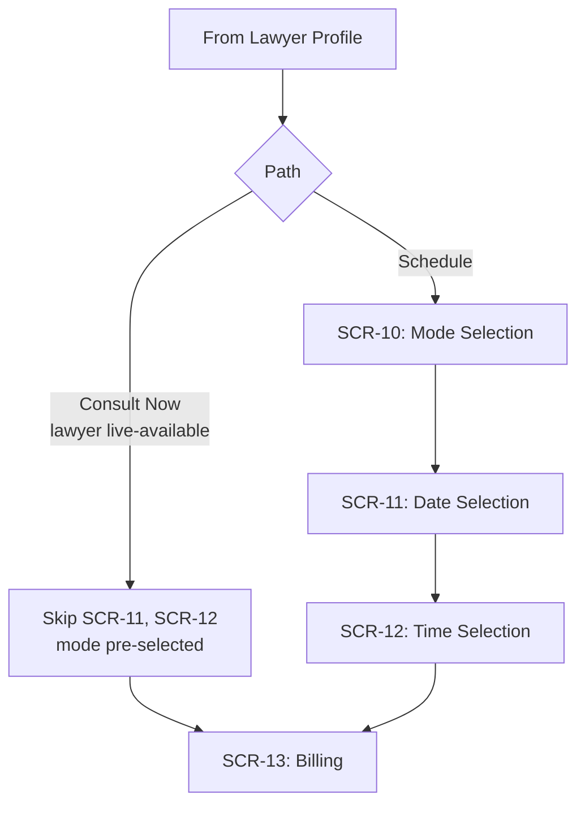

# 10. Module Spec — Consultation Booking (SCR-10, SCR-11, SCR-12)

> **Depends on:** `09_Module_Talk_to_Lawyer.md` (§5 Consult Now vs Schedule fork), `04_Design_System.md` (§5.8 Mode Selector), `05_Screen_Inventory.md`
> **Feeds into:** `11_Module_Billing_Payments.md`, `15_Realtime_Communication_Agora.md`, `17_Notifications.md`

---

## 1. Purpose

Convert a lawyer-profile decision into a scheduled or immediate consultation, at a price the buyer saw before committing. This module has **two distinct entry paths** (from `09` §5) that share the same downstream screens but skip steps differently.

---

## 2. Screen: SCR-10 Mode Selection

- Only reached via the **Schedule** path. Consult Now arrives with mode already selected from the profile screen's fee-selector (`09` §4.1 step 6), so SCR-10 is skipped for that path — do not force a redundant re-selection.
- Segmented control: Chat / Voice / Video, per-minute price shown inline (per `04_Design_System.md` §5.8).
- Selecting a mode is required before "Continue" enables.

---

## 3. Screen: SCR-11 Date Selection

### 3.1 Hard Constraint

**Only the next 5 calendar days are selectable.** This is a fixed V1 rule (Product Vision §4), not a configurable range — do not build a general-purpose calendar picker component here; build a constrained 5-day strip (horizontal chips: Today, Tomorrow, then 3 more dated chips) matching the simplicity implied by the wireframes.

### 3.2 Behavior

- Dates with zero available slots for the selected lawyer+mode combination should still be shown but visually disabled (not hidden) — hiding them would make the 5-day window feel arbitrary/shorter to the user than it is.
- Today is only selectable if the current time still leaves a bookable slot before end of the lawyer's availability window that day.

---

## 4. Screen: SCR-12 Time Selection

### 4.1 Behavior

- Time slots shown as a grid, derived from the lawyer's availability windows (set on the PWA dashboard, read-only here) minus already-booked slots.
- Slot granularity: assume 30-minute increments unless the lawyer's dashboard specifies otherwise — flag as a confirm-before-build item, since neither the wireframes nor content doc specify this explicitly.
- Selecting a slot enables "Continue" → SCR-13 Billing.

### 4.2 States

| State | Behavior |
|---|---|
| Empty (no slots that day) | "No slots available on [date]" + prompt to pick another date (back to SCR-11) |
| Loading | Skeleton grid |
| Error | Retry |

---

## 5. Data Passed Forward to Billing

The Billing screen (SCR-13) needs a single, consistent payload regardless of which path was taken:

- `lawyer_id`, `mode` (chat/voice/video), `price_per_minute`
- `scheduled_date`, `scheduled_time` (null for Consult Now — treated as "immediate")
- `is_instant` (boolean) — this flag is what differentiates Confirmation-screen copy and what triggers immediate vs scheduled Agora session provisioning (see `15_Realtime_Communication_Agora.md`)

This is the same polymorphic-order pattern referenced in `02_Information_Architecture.md` §4 — Billing must accept this payload shape alongside the document-purchase payload shape without needing two separate Billing implementations.

---

## 6. Explicitly Out of Scope for This Module

- No recurring/subscription bookings.
- No multi-lawyer comparison or "book with next available advocate" auto-match — user always books a specific lawyer they chose.
- No in-app calendar sync (Google Calendar, etc.) — confirmation/reminder handled via push/WhatsApp per `17_Notifications.md`, not calendar integration.
- No rescheduling/cancellation flow in this module's V1 scope — if needed, it's a Support-mediated action (SCR-22), not a self-serve UI here. Flag for scope discussion if this is a hard requirement for launch.

---

## 7. Analytics Events

- `booking_mode_selected` (props: `lawyer_id`, `mode`)
- `booking_date_selected` (props: `lawyer_id`, `date`)
- `booking_time_selected` (props: `lawyer_id`, `time`)
- `booking_instant_consult_started` (props: `lawyer_id`, `mode`)
- `booking_continue_to_billing` (props: `lawyer_id`, `is_instant`)

---

*Next: `11_Module_Billing_Payments.md` — the shared Billing screen and Razorpay checkout spec, pending your approval to proceed.*
