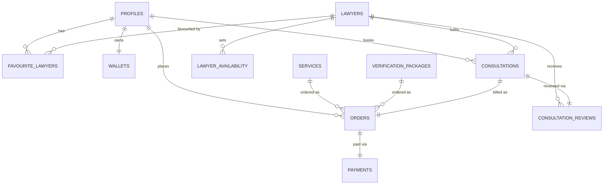

# 13. Data Model — Supabase Schema (Conceptual)

> **Depends on:** all module docs (06–12) — this doc reconciles their data needs into one shared model
> **Feeds into:** `14_Auth_and_Roles.md`, `16_Payments_Razorpay.md`, `18_API_Integration_Contracts.md`
> **Format note:** Per the founding brief, this is conceptual — entities, fields, and relationships only. No SQL, no Supabase-specific syntax. A backend developer turns this into actual Postgres/RLS.

---

## 1. Entity-Relationship Overview

---

## 2. Core Entities

### 2.1 `profiles`
Extends Supabase Auth's built-in user. One row per buyer.

| Field | Notes |
|---|---|
| `id` | = Supabase Auth user id |
| `first_name`, `last_name` | |
| `email`, `email_verified` | |
| `phone`, `phone_verified` | |
| `address`, `state`, `city`, `pincode` | Used in Billing (`11` §2.1) when order type requires it |
| `gender` | Optional |
| `created_at` | |

### 2.2 `wallets`
One row per profile. **View-only balance in V1** — no recharge transactions table needed yet beyond what §2.6 (`payments`) already covers for pre-authorized consultation blocks.

| Field | Notes |
|---|---|
| `profile_id` | FK → profiles |
| `lx_coin_balance` | Integer/decimal, display-only per `12` §4 |
| `held_amount` | Nullable — reflects a pre-authorized consultation hold, if Model A (`11` §4) is confirmed |

### 2.3 `services`
The 8 fixed document services. Effectively a content table, not user-generated.

| Field | Notes |
|---|---|
| `id` | e.g. `gst-registration` |
| `title`, `tag`, `breadcrumb` | |
| `description`, `price_line`, `price_numeric` | |
| `video_url` | Nullable at launch |
| `key_details`, `benefits`, `whats_included`, `faq` | Structured JSON per `07` §3.2 |
| `checklist_required`, `checklist_additional` | Structured JSON, each item: name, formats, max size |
| `how_it_works_steps` | Fixed 4-step structure |
| `has_subtype` | Boolean — true for Legal Notice, Rent Agreement, Affidavit (`07` §3.3) |
| `subtypes` | Structured JSON, nullable, only for `has_subtype = true` services |

### 2.3a `verification_packages` (new — see `01_Product_Vision.md` §4a, `26_Module_Document_Verification.md`)

| Field | Notes |
|---|---|
| `id` | |
| `title` | e.g. per wireframe pricing tiers |
| `price_numeric` | |
| `requires_human_review` | Boolean — **must be `true` for every package in V1** per the open decision in `01` §4a; do not ship a package with this `false` (AI-only) without the dated scope-change confirmation it references |
| `included_features` | Structured list, e.g. review type, turnaround time |

### 2.4 `lawyers`
| Field | Notes |
|---|---|
| `id` | |
| `name`, `photo_url` | |
| `is_enrolled_advocate` | **Must be true to appear anywhere in the app** — hard filter per `09` §1 |
| `is_active` | |
| `bar_enrollment_number` | Compliance record, not necessarily user-facing |
| `experience_years`, `bio` | |
| `languages` | Array |
| `practice_areas` | Array |
| `expertise_tags` | Array |
| `rating_avg`, `review_count`, `consultation_count`, `case_count` | Aggregates (materialized or computed) |
| `fee_chat`, `fee_voice`, `fee_video` | Per-minute rates |
| `is_available_now` | Derived from `lawyer_availability`, or a direct live-status flag set by the lawyer dashboard |

### 2.5 `lawyer_availability`
| Field | Notes |
|---|---|
| `lawyer_id` | FK |
| `date` | Constrained to next 5 days in the app layer (`10` §3.1) — table itself can hold further-out data if the dashboard allows it; the **app enforces the 5-day window on read**, not the schema |
| `time_slot` | Assume 30-min granularity per `10` §4.1, pending confirmation |
| `is_booked` | |

### 2.6 `orders`
The shared, polymorphic entity behind Billing (`11` §2.2). This is the single most important reconciliation in this schema — one table serves two very different-looking flows.

| Field | Notes |
|---|---|
| `id` | |
| `profile_id` | FK |
| `order_type` | `document` \| `verification` \| `consultation` — updated per confirmed Final Payment Architecture (`01` §4a) |
| `item_id` | `service_id`, `verification_package_id`, or `lawyer_id`, depending on `order_type` |
| `item_title` | Denormalized snapshot at time of order (protects order history if service content changes later) |
| `metadata` | JSON — subtype selection (document), or `uploaded_file_url`/`language`/`problem_type` (verification), or mode/schedule/is_instant (consultation), depending on type |
| `price_snapshot` | The price shown at Billing, locked at order creation |
| `status` | `pending_payment` \| `paid` \| `failed` \| `refunded` |
| `created_at` | |

**Order is only created as `paid` after Razorpay webhook confirmation** — never client-side (`11` §3). A `pending_payment` row may be created at Buy Now tap for tracking abandonment, but must never be treated as a completed transaction anywhere in the app (e.g. must not appear in Transactions/SCR-21 until `paid`).

### 2.7 `consultations`
Created alongside a `consultation`-type order, once paid. Tracks the actual session, separate from the payment record.

| Field | Notes |
|---|---|
| `id` | |
| `order_id` | FK → orders |
| `lawyer_id`, `profile_id` | |
| `mode` | chat/voice/video |
| `scheduled_at` | Nullable for instant consults |
| `is_instant` | |
| `agora_session_id` | Set at session start — see `15_Realtime_Communication_Agora.md` |
| `actual_duration_minutes` | Set at session end, used to true-up billing under Model A (`11` §4) |
| `status` | `scheduled` \| `in_progress` \| `completed` \| `no_show` \| `cancelled` |

### 2.8 `consultation_reviews`
| Field | Notes |
|---|---|
| `consultation_id` | FK |
| `profile_id`, `lawyer_id` | |
| `rating` | 1–5 |
| `review_text` | Nullable |

### 2.9 `favourite_lawyers`
Simple join table: `profile_id`, `lawyer_id`, `created_at`.

### 2.10 `payments`
| Field | Notes |
|---|---|
| `order_id` | FK |
| `razorpay_payment_id`, `razorpay_order_id` | |
| `amount`, `currency` | |
| `status` | Mirrors Razorpay's own status vocabulary — see `16_Payments_Razorpay.md` |
| `coupon_code`, `discount_amount` | Nullable |

---

## 3. Row-Level Security — Intent (not policy syntax)

| Table | Read | Write |
|---|---|---|
| `profiles` | Own row only | Own row only (except verified-status fields, server-controlled) |
| `wallets` | Own row only | Server/webhook-controlled only — never direct client write |
| `services` | Public read (all authenticated users) | Admin/CMS only, not exposed to app users |
| `verification_packages` | Public read (all authenticated users) | Admin/CMS only, not exposed to app users |
| `lawyers` | Public read, filtered to `is_enrolled_advocate = true` **at the query level, not just app UI** — this is the compliance-critical rule from `09` §1 and must be enforced server-side | Lawyer dashboard only, not this app |
| `lawyer_availability` | Public read | Lawyer dashboard only |
| `orders` | Own rows only | Insert via app (pending), update only via server/webhook (paid/failed/refunded) |
| `consultations` | Own rows (as buyer) or own rows (as lawyer, via dashboard) | Server-controlled state transitions; Agora session fields set server-side |
| `consultation_reviews` | Public read (aggregate), own row for write | Own row only, only after `consultation.status = completed` |
| `favourite_lawyers` | Own rows only | Own rows only |
| `payments` | Own rows only (via order ownership) | Server/webhook only |

**The single most important RLS rule in this document:** a non-enrolled individual must be structurally impossible to serve through the `lawyers` public-read policy — this is a legal-exposure boundary (`09` §1), not just a UX filter, and should be tested explicitly in `22_QA_Test_Plan.md`.

---

## 4. Explicitly Deferred (V2 schema, not designed here)

- Any table backing LX Coin recharge/purchase transactions beyond the pre-authorization hold in `wallets.held_amount`.
- Document Vault/Escrow storage tables.
- Referral/invite tracking tables.
- AI Assistant conversation/session tables.

---

*Next: `14_Auth_and_Roles.md` — Supabase Auth setup, user vs lawyer roles, session rules, pending your approval to proceed.*
