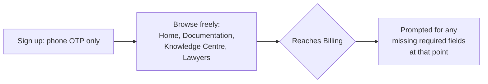

# 14. Auth & Roles — Supabase Auth

> **Depends on:** `13_Data_Model_Supabase_Schema.md` (§2.1 profiles, §3 RLS intent)
> **Feeds into:** `15_Realtime_Communication_Agora.md`, `18_API_Integration_Contracts.md`, `20_Non_Functional_Requirements.md`

---

## 1. Roles in the System

Two distinct identity surfaces, deliberately kept separate:

| Role | Where they authenticate | Owns |
|---|---|---|
| **Buyer** (this app's user) | LegalX mobile app | `profiles` row, orders, consultations, favourites |
| **Lawyer/Advocate** | Separate PWA dashboard (not this app) | `lawyers` row, availability, consultation fulfilment |

**This app (React Native) only implements Buyer authentication.** Lawyer auth belongs to the PWA dashboard's own doc set — this app only ever *reads* lawyer data, never authenticates a lawyer session. Keep this boundary explicit so no developer accidentally builds a lawyer login screen inside the buyer app.

---

## 2. Buyer Authentication Method

### 2.1 Primary: Phone OTP (recommended default for India-first UX)

- Phone number entry → Supabase Auth OTP (SMS) → 6-digit code entry → session created.
- Matches the profile fields already defined (`13` §2.1: `phone`, `phone_verified`).
- Recommended as primary over email/password given the target user (small business owners, freelancers) and India-first context — phone OTP has meaningfully lower drop-off than password-based signup in this market. Flag for confirmation since the founding brief didn't specify a method explicitly.

### 2.2 Secondary: Google Sign-In

- Reference build (video 2) showed Google OAuth as a fast-path option — reasonable to include as a secondary method since it's low build cost via Supabase Auth's built-in provider and reduces friction for users who prefer it.
- Email from Google populates `profiles.email`, `email_verified = true` automatically.

### 2.3 Not Recommended for V1

- Email + password — adds a forgot-password flow, weaker security posture for this user base, no strong reason to include alongside OTP + Google. Omit unless you have a specific reason to keep it.

---

## 3. Session Rules

| Rule | Detail |
|---|---|
| Session persistence | Persist across app restarts (standard "stay logged in") — re-auth only on explicit logout or token expiry |
| Token refresh | Handled by Supabase client SDK automatically; no custom refresh logic needed |
| Session expiry → mid-flow | If a session expires mid-checkout (Billing/Payment), the app must preserve the in-progress order payload and return the user to Billing after re-auth, not drop them back to Home. Flag this explicitly for `11_Module_Billing_Payments.md` implementation — losing a near-completed purchase to a silent session expiry is a real conversion risk. |
| Logout | Confirmation dialog (per `12` §2.1), clears local session, does not delete any server-side data |

---

## 4. Verification Requirements

| Field | Required before... |
|---|---|
| `phone_verified` | Required to place any order (document or consultation) — phone is the contact channel for delivery/reminders (`17_Notifications.md`) |
| `email_verified` | Not required to transact, but required before certain account actions (e.g. receiving formal receipts/invoices via email) — soft requirement, not a blocker |

---

## 5. Profile Completeness Gate

Billing (`11` §2.1) requires name, phone, and — conditionally — address. Rather than forcing full profile completion at signup (which adds friction before a user has even seen the product), **defer non-critical profile fields until they're actually needed at Billing.** This matches the low-friction-first-run pattern implied by the reference builds and avoids a bloated onboarding form.

---

## 6. Explicitly Out of Scope for This Module

- No social login beyond Google (no Facebook/Apple Sign-In unless iOS App Store review requires Apple Sign-In as a parity option — flag for `23_Release_Environment_Strategy.md` if targeting iOS, since Apple mandates this when other social logins are offered).
- No multi-factor authentication beyond OTP-as-primary-factor.
- No account deletion self-serve flow specified here — route through Support (`12` §8) for V1; formal DPDP-compliant deletion workflow is a `20_Non_Functional_Requirements.md` concern.

---

*Next: `15_Realtime_Communication_Agora.md` — chat/voice/video session lifecycle and token flow, pending your approval to proceed.*
