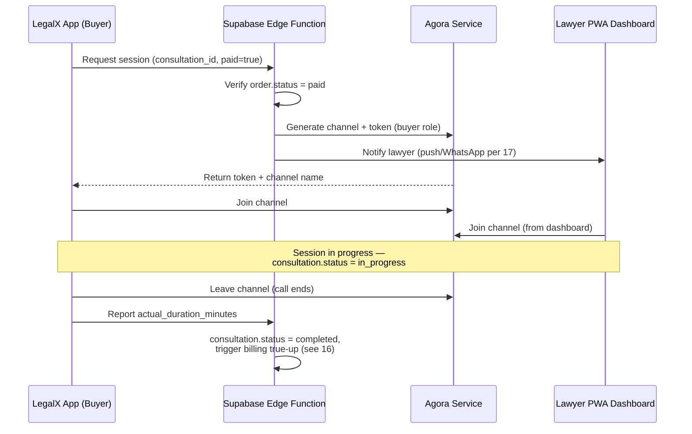

# 15. Realtime Communication — Agora (Chat, Voice, Video)

> **Depends on:** `10_Module_Consultation_Booking.md` (§5 order payload), `13_Data_Model_Supabase_Schema.md` (§2.7 consultations), `14_Auth_and_Roles.md`
> **Feeds into:** `16_Payments_Razorpay.md` (§ billing true-up), `17_Notifications.md`, `20_Non_Functional_Requirements.md`

---

## 1. Purpose

Agora powers all three consultation modes (Chat, Voice, Video) per the founding brief. This doc defines the session lifecycle and token handling at a conceptual level — actual Agora SDK integration is an engineering task, not something this doc prescribes in code.

---

## 2. Session Lifecycle

**Key rule: a session token is only issued after server-side confirmation that the order is paid.** Never generate an Agora token client-side or based on client-asserted payment status — this mirrors the same "server confirms, client never self-asserts" pattern used for orders in `13` §2.6.

---

## 3. Mode-Specific Notes

### 3.1 Chat
- Text-based, persisted for the duration of the consultation record (not indefinitely — retention policy is a `20_Non_Functional_Requirements.md` / DPDP concern).
- File attachment support implied by wireframes ("Termination_Notice.pdf" shared in reference chat) — reasonable for a legal consultation context (sharing a document to discuss). Flag as confirm-before-build since it adds file-handling scope (storage, size limits, virus scanning) beyond a plain text channel.

### 3.2 Voice
- Standard Agora voice channel, buyer + lawyer only (no group calls in V1).

### 3.3 Video
- Standard Agora video channel, same 1:1 constraint.
- No recording by default — recording a legal consultation has real privacy/consent implications (both parties' consent, data retention, potential evidentiary use). **Do not enable Agora's cloud recording feature without an explicit decision and consent-flow design** — flag for `20_Non_Functional_Requirements.md`.

---

## 4. Instant vs Scheduled Session Provisioning

Ties back to `10_Module_Consultation_Booking.md` §5 `is_instant` flag:

| Type | Provisioning trigger |
|---|---|
| Instant (Consult Now) | Session/channel created immediately on payment success, both parties expected to join within a short window (e.g. 2 minutes) — if lawyer doesn't join in time, treat as a no-show and initiate refund/reschedule (policy owned by `16_Payments_Razorpay.md`) |
| Scheduled | Channel created shortly before the scheduled time (not at booking time) — avoids holding open, unused Agora resources for consultations booked days in advance. Join button/notification surfaces to the buyer a few minutes before `scheduled_at` (per `17_Notifications.md`) |

---

## 5. Duration Tracking → Billing Feed

`actual_duration_minutes` on the `consultations` record (`13` §2.7) is the source of truth for the Model A pre-authorization true-up defined in `11_Module_Billing_Payments.md` §4. This value must come from server-side session event timestamps (join/leave events reported to the backend), **not from client-side timers**, since a client-reported duration is trivially spoofable and this number directly affects what the buyer is charged.

---

## 6. Explicitly Out of Scope for This Module

- No call recording/transcription in V1 (§3.3).
- No group/multi-party calls.
- No in-call screen-sharing (not referenced in any source material — don't add without a scope note).
- No AI-powered call summarization (Product Vision §5 — no AI features in V1).

---

## 7. Analytics Events

- `consultation_session_created` (props: `consultation_id`, `is_instant`, `mode`)
- `consultation_session_joined` (props: `consultation_id`, `role: buyer`)
- `consultation_session_ended` (props: `consultation_id`, `duration_minutes`)
- `consultation_no_show` (props: `consultation_id`, `party: lawyer|buyer`)

---

*Next: `16_Payments_Razorpay.md` — order creation, webhook handling, refund policy, pending your approval to proceed.*
