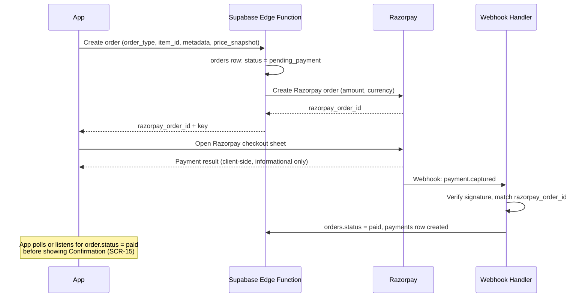

# 16. Payments — Razorpay

> **Depends on:** `11_Module_Billing_Payments.md` (§4 consultation billing model decision), `13_Data_Model_Supabase_Schema.md` (§2.6 orders, §2.10 payments), `15_Realtime_Communication_Agora.md` (§5 duration tracking)
> **Feeds into:** `17_Notifications.md`, `20_Non_Functional_Requirements.md`, `22_QA_Test_Plan.md`

---

## 1. Purpose

Define the payment lifecycle for both order types, with one hard rule underpinning everything: **the client never determines payment success — only a server-verified webhook does.**

---

## 2. Order Creation Flow (both order types)

**Critical:** the client-side "payment result" callback from the Razorpay SDK is treated as informational only — it triggers the app to *check* order status, not to *set* it. The webhook is the only source of truth for `status = paid`.

---

## 3. Document Order Payments

- Single charge, amount = `price_snapshot` from Billing (`11` §2.2), minus any applied coupon discount.
- Straightforward capture-on-payment; no true-up needed (unlike consultations).

---

## 4. Consultation Order Payments (Model A — Pre-Authorized Block)

Per the decision in `11_Module_Billing_Payments.md` §4:

1. At Billing, buyer is charged for a fixed block (recommend 15 minutes as the default block size — confirm with your team; not specified in source material).
2. Payment captured immediately (Razorpay doesn't natively support true "authorize now, capture later" the way some Western processors do — confirm this against current Razorpay capabilities before finalizing, since payment-gateway feature sets change).
3. After the consultation ends, `actual_duration_minutes` (from `15` §5) is compared to the paid block:
   - **Under block time used** → partial refund for unused minutes, processed via Razorpay refund API.
   - **Over block time used** → a follow-up charge is required. This needs a saved payment method or a new checkout for the overage — **flag as an open design question**, since neither wireframes nor content docs specify overage handling, and it directly affects whether a consultation can run long without friction.
4. **No-show handling** (per `15` §4): if the lawyer doesn't join within the grace window, full refund, no true-up needed.

This overage question (#3) is the single biggest unresolved payments decision in this doc set — recommend resolving it before backend work on this flow begins, since it affects both the data model (`13` §2.7 `actual_duration_minutes` usage) and the UX (does a call get cut off at the block limit, or continue and bill after?).

---

## 5. Coupons

- Applied at Billing (`11` §2.1), validated server-side before order creation (never trust a client-calculated discount amount).
- Coupon logic (eligibility rules, stacking, expiry) is a backend/admin concern — this doc only confirms the touchpoint exists in the payment flow, not the coupon engine's rules.

---

## 6. Refund Policy (V1 baseline — confirm with founder/legal before launch)

| Scenario | Refund |
|---|---|
| Payment failed before capture | N/A — no charge occurred |
| Buyer cancels document order before fulfilment starts | Full refund — exact "before fulfilment starts" cutoff needs an operational definition (e.g. before an advocate has begun drafting) |
| Lawyer no-show (consultation) | Full refund, automatic |
| Buyer no-show (consultation) | No refund (standard practice, but confirm — not specified in source material) |
| Consultation under-time (Model A) | Partial refund for unused block minutes, automatic |

---

## 7. Explicitly Out of Scope for This Module

- No installment/EMI, no saved cards beyond Razorpay's own native handling.
- No multi-currency support (INR only — Product Vision confirms India-only target).
- No manual/offline payment recording (bank transfer, cash) — all payments flow through Razorpay checkout.

---

## 8. Analytics Events

- `payment_order_created` (props: `order_type`, `amount`)
- `payment_captured` (props: `order_id`, `amount`)
- `payment_failed` (props: `order_id`, `reason`)
- `refund_issued` (props: `order_id`, `amount`, `reason`)

---

*Next: `17_Notifications.md` — push/WhatsApp fallback rules, pending your approval to proceed.*
