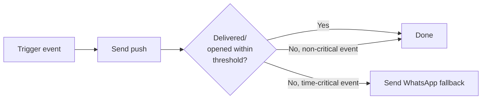

# 17. Notifications

> **Depends on:** `10_Module_Consultation_Booking.md`, `15_Realtime_Communication_Agora.md` (§4 session provisioning), `16_Payments_Razorpay.md`
> **Feeds into:** `20_Non_Functional_Requirements.md`, `23_Release_Environment_Strategy.md`

---

## 1. Purpose

Keep both sides of a consultation on time, and keep buyers informed on order/payment status — without building a notification system heavier than a V1 launch needs.

**Note on scope:** this doc covers **buyer-side** notifications (this app). Lawyer-side notification delivery (FCM web push + WhatsApp fallback for the PWA dashboard) was already decided in earlier architecture work and is referenced here for consistency, but its implementation lives in the lawyer dashboard's own doc set, not this one.

---

## 2. Notification Channels (Buyer-Side)

| Channel | Use case |
|---|---|
| Push (FCM, native mobile) | Primary channel — booking confirmations, reminders, payment status, session-ready alerts |
| WhatsApp | Fallback for critical, time-sensitive alerts if push fails/is disabled — matches the Android-first, WhatsApp-fallback pattern already established for the lawyer side; extending it to buyers is consistent, not a new pattern |
| In-app | Any notification also has an in-app equivalent (e.g. a badge on Profile → Call History) so nothing is push-only |

**Do not build SMS or email as primary channels** — push + WhatsApp fallback covers the target user base (Android-first, India) more reliably and cheaply than SMS, and email open rates for time-sensitive alerts (e.g. "your lawyer is ready") are too slow to be useful.

---

## 3. Notification Triggers

| Event | Channel | Timing |
|---|---|---|
| Document order payment confirmed | Push + in-app | Immediate |
| Consultation booking confirmed | Push + in-app | Immediate |
| Scheduled consultation reminder | Push, WhatsApp fallback | ~15 min before `scheduled_at` |
| Instant consultation session ready (lawyer joined/channel live) | Push, WhatsApp fallback | Immediate |
| Lawyer no-show / refund issued | Push + in-app | Immediate |
| Payment failed | Push + in-app | Immediate |
| Coupon-related | None — not a notification-worthy event | — |

---

## 4. WhatsApp Fallback Logic

Fallback threshold and "time-critical" classification (which events warrant WhatsApp fallback vs. which don't) should be confirmed against whatever threshold was already set for the lawyer-side pattern, for consistency — flag for reconciliation with that earlier decision rather than inventing a new threshold here.

---

## 5. Notification Preferences

- Per `12_Module_Profile.md` §2.1, notification settings are a simple in-line toggle on the Profile root screen, not a dedicated settings screen — keep this consistent, don't over-build a granular per-category preference center for V1.
- Minimum viable toggle set: "Booking & payment updates" (on by default, cannot be fully disabled — these are transactional, not marketing) vs. "Reminders" (on by default, user-toggleable).
- No promotional/marketing push notifications in V1 scope — nothing in the founding brief calls for a marketing notification system, and adding one now would be scope creep into growth/retention features not yet defined.

---

## 6. Explicitly Out of Scope for This Module

- No in-app notification center/inbox screen (beyond the in-app equivalents noted in §2) — not specified in wireframes or content docs.
- No SMS channel.
- No marketing/promotional push campaigns.

---

## 7. Analytics Events

- `notification_sent` (props: `type`, `channel`)
- `notification_opened` (props: `type`, `channel`)
- `whatsapp_fallback_triggered` (props: `type`)

---

*Next: `18_API_Integration_Contracts.md` — request/response contracts between the app and Supabase functions, pending your approval to proceed.*
