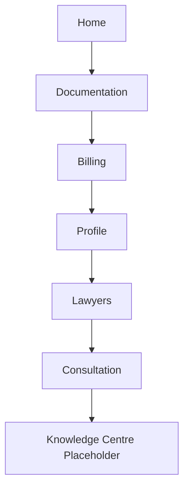

# 25_PROJECT_CONTEXT.md

> **Audience:** All AI coding assistants and human contributors — read alongside `24_AI_BUILD_GUIDE.md`.
> **Purpose:** Team ownership boundaries and build sequencing for LegalX V1. Where this doc sets an order or process, it governs execution sequence; `01`–`23` still govern scope and design; `24` still governs code style.

---

## 1. Project Version

**V1 MVP.**

## 2. Mission

Build a production-ready React Native LegalTech app.

## 3. Current Team

| Role | Owner |
|---|---|
| Founder | Prince |
| Frontend AI | Antigravity |
| Backend | Interns |
| Knowledge Centre | Dedicated intern (pre-existing build, per `08_Module_Knowledge_Centre.md`) |

## 4. What Antigravity Owns

- React Native UI
- Navigation
- Components
- Reusable architecture
- Animations (per `24_AI_BUILD_GUIDE.md` §21 — minimal, functional only)
- Frontend integration (consuming, not implementing, backend contracts per `18_API_Integration_Contracts.md`)

## 5. What Antigravity Does NOT Own

- Backend
- Supabase
- Database
- Authentication backend
- Payment verification
- Agora token server
- Knowledge Centre backend
- GitHub fetch
- Business logic

*(Matches `24_AI_BUILD_GUIDE.md` §8, §36, §37 exactly — restated here as the team-facing version of the same boundary.)*

## 6. How to Build

**One screen at a time. Never generate the whole app.**

1. Complete one screen.
2. Wait for review.
3. Move to the next screen.

This overrides any instinct (from `24_AI_BUILD_GUIDE.md` or elsewhere) to batch-generate multiple screens in one pass — sequencing discipline is a project-management decision, not a code-quality one, and this doc is the authority on it.

## 7. Build Priority Order

**Sequencing note:** Billing is built third, before Lawyers/Consultation exist — this means Billing is first implemented and tested against the **document-purchase payload only** (`11_Module_Billing_Payments.md` §2.2). The consultation-order payload variant of Billing gets wired in once Consultation (step 6) is built. Don't treat an early Billing build as "done" until both payload shapes are verified — re-test Billing after Consultation lands, not just at step 3.

## 8. Definition of Done

Every screen must satisfy all of the following before being considered complete:

- [ ] No TypeScript errors
- [ ] No duplicated components
- [ ] Responsive (Android phone size range, per `24_AI_BUILD_GUIDE.md` §20)
- [ ] Reusable (shared patterns extracted per `24` §28)
- [ ] Production ready
- [ ] No TODOs *(see conflict note below)*
- [ ] No mock APIs
- [ ] No backend code
- [ ] No feature creep
- [ ] No Dark Mode
- [ ] No Light Mode toggle — one theme only
- [ ] Android only
- [ ] English only

---

## 9. Known Conflict — "No TODOs" vs. Backend Integration Points

`24_AI_BUILD_GUIDE.md` §8, §36, and §37 instruct the AI to leave a "clearly marked TODO" at backend integration seams. This document's Definition of Done says **No TODOs**. These cannot both be followed literally.

**Resolution (pending your confirmation):** replace the TODO pattern with **typed function stubs** that reference the exact contract in `18_API_Integration_Contracts.md` — e.g., a fully-typed `createOrder(payload: CreateOrderInput): Promise<CreateOrderResponse>` whose body calls a not-yet-implemented service function, rather than a comment saying `// TODO: implement`. This satisfies "no TODOs" as a literal code-search criterion while still giving interns an unambiguous, type-checked seam to fill in.

`24_AI_BUILD_GUIDE.md` §8/§36/§37 should be patched to reflect this once confirmed — flagging here rather than silently editing an already-approved doc.

---

*This document governs build sequencing and team boundaries. It does not change product scope (`01`–`23`) or code-style rules (`24`) except where explicitly noted in §9.*
